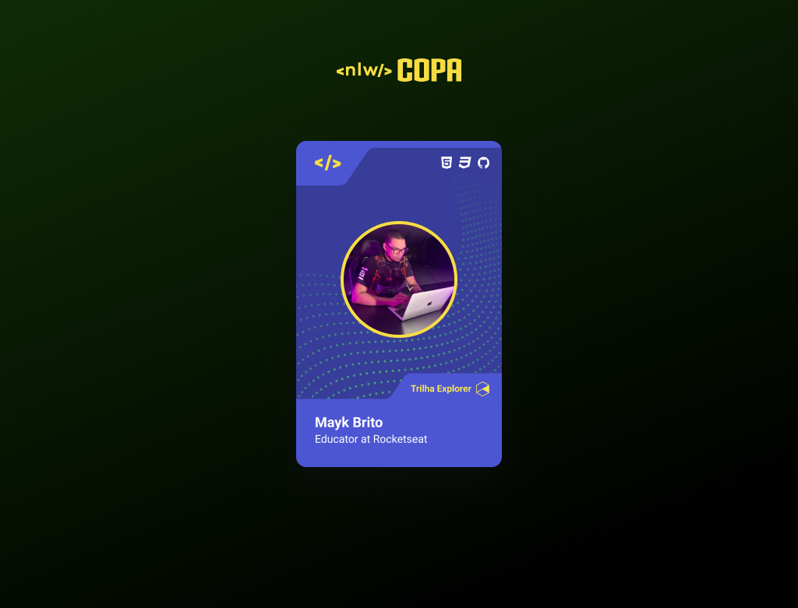

<h1 align="center"> Card NLW Copa </h1>

Figurinha da copa personalizada desenvolvida como aquecimento para a NLW Copa.

  <a href="#-projeto">Projeto</a>&nbsp;&nbsp;&nbsp;|&nbsp;&nbsp;&nbsp;
  <a href="#-tecnologias">Tecnologias</a>&nbsp;&nbsp;&nbsp;|&nbsp;&nbsp;&nbsp;
  <a href="#-layout">Layout</a>

  

## 💻 Projeto

Figurinha da copa com foto de perfil, nome e descrição personalizados, onde é possível alternar o background do card de acordo com a trilha do usuário (Explorer ou Ignite) na NLW Copa.

## 🚀 Tecnologias

Esse projeto foi desenvolvido com as seguintes tecnologias:

- HTML e CSS;
- JavaScript;
- Git e GitHub.

## 🔖 Layout

Você pode visualizar o layout do projeto através [deste link](https://www.figma.com/file/o3FcJiDFDsBLpQ2VpvXCGZ/NLW-Copa-Card).

---

Feito com 💜 by [Rocketseat](https://www.rocketseat.com.br/).
